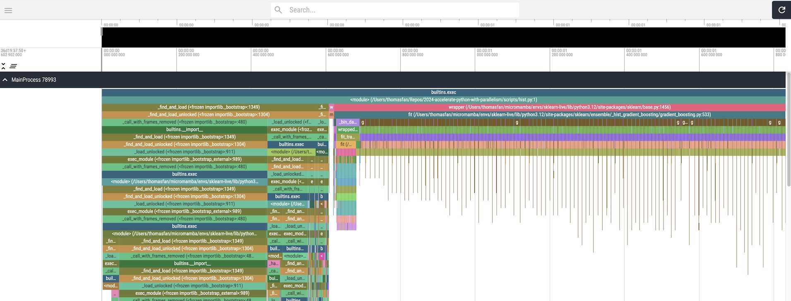
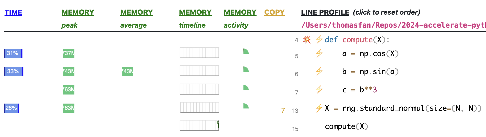

title: This is the title
use_katex: True
class: title-slide

# This is a title for a presentation With more than one line

.larger[Thomas J. Fan]<br>
<a href="https://www.github.com/thomasjpfan" target="_blank" class="title-link"><span class="icon icon-github right-margin"></span>@thomasjpfan</a>
<a class="this-talk-link", href="https://github.com/thomasjpfan/slides-template" target="_blank">github.com/thomasjpfan/slides-template</a>

---

class: top

<br>

# Me

- Senior Machine Engineer @ Union.ai

.g.g-middle[
.g-6.g-end[

]
.g-6.g-start[

]
]

--

- Maintainer for scikit-learn

.center[

]

---

# Agenda 📓

- Why Cython? 🚀
- Cython 101 🍀
- Scikit-learn Use Cases 🛠️

---

class: chapter-slide

# Why Cython? 🚀

---

# Why Cython? 🚀

## Speed
- Reduce Memory Usage
- Improve CPU Usage


---

# Why Cython? 🚀
## Profiling

## Improving existing code
- Already have code to profile

## Writing new code
- Use libraries team is familiar with as a first pass


---

# Finding Hot-spots 🔎
## `cProfile` + snakeviz

```bash
python -m cProfile -o hist.prof hist.py
snakeviz hist.prof
```


---

# Finding Hot-spots 🔎
## `viztracer`

```bash
viztracer hist.py
vizviewer result.json
```



---

# Memory Profiling 🧠
## `memray`

```bash
memray run np-copy.py
memray flamegraph memray-np-copy.py.88600.bin
```


---

# Memory Profiling 🧠
## `memray`


---

# Memory Profiling 🧠
## Scalene

```bash
scalene np-copy.py
```



---

class: chapter-slide

# Cython 101 🍀

---

# Cython 101 🍀

- Compiling
- Types
- Memoryviews
- Developing Tips

---

# Compiling

```python
# simple.pyx

def add(x, y):
    return x + y
```

--

```python
from setuptools import setup
from Cython.Build import cythonize

setup(
    ext_modules=cythonize("simple.pyx"),
)
```

```bash
python setup.py build_ext --inplace
```

---

# Importing from Python code

```python
import simple

result = simple.add(10, 12)

print(result)
```

--

## Current Benefits

- Removes the Python interpreter

---

# Adding Types

```python
# simple.pyx

def add(x: int, y: int):
    return x + y
```

--

## Benefits

- Removes the Python interpreter
- Compiler can optimize with types

---

# Defining Functions

- `def` : Call from Python
- `cdef` : Call from Cython
- `cpdef` : Call from Python & Cython

--

```python
*cdef float linear(slope: float, x: float, b: float):
    return slope * x + b

def two_linear(slope: float, x: float, b: float):
    cdef:
*       float r1 = linear(slope, x, b)
*       float r2 = linear(-slope, x, b)
*       float result = r1 + 2 * r2

    return result
```

---

# Developing
## Annotation

```bash
cython --annotate simple.pyx
```


---

# Working in Jupyter


---

# Working in Jupyter (Annotation)


---

class: chapter-slide

# Scikit-learn Use Cases 🛠️

---

# Scikit-learn Use Cases 🛠️

- Python <> Cython interface
- Performance
- Structural Patterns

---

# Python <> Cython interface - NumPy Arrays

```python
%% cython
*def add_value(float[:, :] X, float value):
	...
```

```python
import numpy as np
y = np.ones(shape=(3, 2), dtype=np.float32)

result = add_value(y, 1.4)
```

--

## Python Buffer Protocol

- Python [Buffer Protocol](https://docs.python.org/3/c-api/buffer.html)

---

# Python <> Cython interface - NumPy Arrays
## Write loops!

```python
%% cython
def add_value(double[:, :] X, double value):
    cdef:
        size_t i, j
        size_t N = X.shape[0]
        size_t M = X.shape[1]

    for i in range(N):
        for j in range(M):
            X[i, j] += value
```

--

## It's okay! 😆

---

# Scikit-learn Optimizations for memoryviews
## Directives!

```python
scikit_learn_cython_args = [
  '-X language_level=3',
  '-X boundscheck=' + boundscheck,
  '-X wraparound=False',
  '-X initializedcheck=False',
  '-X nonecheck=False',
  '-X cdivision=True',
  '-X profile=False',
```

.footnote[
[Source](https://github.com/scikit-learn/scikit-learn/blob/main/sklearn/meson.build#L183-L190)
]

---

# Memoryview directives (`boundscheck=True`)

```python
%%cython --annotate
# cython: language_level=3

def add_one(float[:, :] X):
    X[0, 0] += 1
```


---


# Memoryview directives (`boundscheck=False`)

```python
@cython.boundscheck(False)
def add_one(float[:, :] X):
    X[0, 0] += 1
```


---

# Memoryview directives (`wraparound=True`)

```python
@cython.boundscheck(False)
def add_one(float[:, :] X):
    X[0, 0] += 1
```


---

# Memoryview directives (`wraparound=False`)

```python
@cython.boundscheck(False)
@cython.wraparound(False)
def add_one_bad(float[:, :] X):
    cdef:
        float[:, :] X_ref = X
    X[0, 0] += 1
```

---

# Cython directives
## Define per file

```python
# cython: language_level=3
# cython: boundscheck=False
# cython: wraparound=False
cimport cython

...
```

---

# scikit-learn configuration
## Dynamic configure `boundscheck` for testing

```python
scikit_learn_cython_args = [
  '-X language_level=3',
  '-X boundscheck=' + boundscheck,
```

---

# Returning memoryviews

```python
def _make_unique(...):
    cdef floating[::1] y_out = np.empty(unique_values, dtype=dtype)

	# Compute

    return(
        np.asarray(x_out[:i+1]), ...
    )
```

.footnote[

]

---

# Strides 1D

- `float[:]` - Unknown contiguous
- `float[::1]` - Contiguous 1D

<!-- TODO: Picture of the two options -->

---

# Strides 2D

- `float[:, ::1]` - C contiguous
- `float[::1, :]` - F contiguous

<!-- TODO: Picture of the two options -->

---

# Const memoryviews
## Support readonly data

```python
cpdef floating _inertia_dense(
*       const floating[:, ::1] X,           # IN
*       const floating[::1] sample_weight,  # IN
        const floating[:, ::1] centers,     # IN
        const int[::1] labels,              # IN
        int n_threads,
        int single_label=-1,
):
```
`KMeans`, `BisectingKMeans`

.footnote[
[Source](https://github.com/scikit-learn/scikit-learn/blob/master/sklearn/cluster/_k_means_common.pyx#L94-L101)
]

---

# Const memoryviews
## Support readonly data - Use case

<!-- Show readonly with SuccessiveHalving -->

---

# Structs

```python
cdef struct BuildPrunedRecord:
    intp_t start
    intp_t depth
    intp_t parent
    bint is_left
```

.footnote[

]

---

# Packed Structs for memoryviews

```python
cdef packed struct hist_struct:
    Y_DTYPE_C sum_gradients
    Y_DTYPE_C sum_hessians
    unsigned int count
```
https://github.com/scikit-learn/scikit-learn/blob/main/sklearn/ensemble/_hist_gradient_boosting/common.pxd#L12-L17

```python
HISTOGRAM_DTYPE = np.dtype([
    ('sum_gradients', Y_DTYPE),  # sum of sample gradients in bin
    ('sum_hessians', Y_DTYPE),  # sum of sample hessians in bin
    ('count', np.uint32),  # number of samples in bin
])
```
https://github.com/scikit-learn/scikit-learn/blob/main/sklearn/ensemble/_hist_gradient_boosting/common.pyx#L20-L24

---

# Packed Structs for memoryviews

```python
hist_struct [:, ::1] histograms = np.empty(
	shape=(self.n_features, self.n_bins),
	dtype=HISTOGRAM_DTYPE
)
```
https://github.com/scikit-learn/scikit-learn/blob/main/sklearn/ensemble/_hist_gradient_boosting/histogram.pyx#L141-L144

https://numpy.org/doc/stable/user/basics.rec.html


---

# "Cython classes": Extension Types

```python
cdef class Tree:
	cdef public intp_t n_features
	cdef intp_t* n_classes
	cdef public intp_t n_outputs
	...
	cdef Node* nodes
	cdef float64_t* value
```

- `DecisionTree{Regressor,Classifier}`
- `RandomForest{Regressor,Classifier}`
- `GradientBoosting{Regressor,Classifier}`

https://github.com/scikit-learn/scikit-learn/blob/main/sklearn/tree/_tree.pxd#L36-L54

---

# "Cython classes": Extension Types

```python
cdef class Tree:
    def __cinit__(self, intp_t n_features, cnp.ndarray n_classes, intp_t n_outputs):
        safe_realloc(&self.n_classes, n_outputs)
		...

	cdef int _resize_c(self, intp_t capacity=INTPTR_MAX) except -1 nogil:
		...
        safe_realloc(&self.nodes, capacity)

    def __dealloc__(self):
        free(self.n_classes)
		free(self.nodes)
		...
```

https://github.com/scikit-learn/scikit-learn/blob/master/sklearn/tree/_tree.pyx#L783

---

# Releasing the GIL
## What is the GIL?

---

# Why Release the GIL

```python
trees = Parallel(
	n_jobs=self.n_jobs,
	verbose=self.verbose,
	prefer="threads",
)(
	delayed(_parallel_build_trees)(...)
```

- `RandomForest{Classifier,Regressor}`

---

# Releasing the Gil in Cython


```python
*with nogil:
	builder_stack.push(...)
	...
	node_id = tree._add_node(...)
	splitter.node_value(...)
```

https://github.com/scikit-learn/scikit-learn/blob/master/sklearn/tree/_tree.pyx#L213

---

# nogil in function definition

```python

```

---

class: chapter-slide

# Performance

---


# OpenMP With

# C++ (Map)

https://github.com/scikit-learn/scikit-learn/blob/master/sklearn/utils/_fast_dict.pxd#L17-L20

---

- Scikit-learn Use Cases
	- Python <-> Cython interaction
		- Release GIL
			- context manager syntax
				- _tree.pyx
			- nogil in function def
				- _splitter.pxd
	- Performance
		- nan check
		- prange (openmp)
			- Simple example
				- _binning.pyx
			- Compiler flag
				- Openmp flag
		- ~~Import NumPy C API~~
			- Cimport numpy as cnp
				- Import_array
		- Calling SciPy BLAS directly
			- Calling external functions
		- C+
			- RAI
				- shared pointer
				- Smart pointet
			- Map
				- Intfloatdict
				- Hirearchical_fast
			- Algorithm
				- _tree.pyx
			- Vector
				- Dbscan_inner
				- Memoryview wrapping
				- haahing_fast
				- _vector_sentinel.pyx
	- DRY
		- Pyd files
			- cimport from other files
		- Fused Types
			- Generics
				- simple function
				- Memoryview
			- with C++
				- Vector
		- Tempita for generating
			- Extension types for “fused”
			- Weight vector
		 - Vtable lookup
			 - Final
				 - pairwise reduction
			 - pyi files
				 - Binary tree
			 - Tempita generation
				 - Loss
			 - Fused types with extension array
				 - Tree partition
 - Review slide for performance uplift - peak of talk
	- Lightgbm like performance
	- Pairwise reduction normal
	- Pairwise reduction class mode
	- Loss - linear models
	-  memory improvements
		- Nan check
		- intfloatdict
		-
 - Review slide on Cython features
	 - World cloud
- Conclusion

Move profiling tools to appendix
Alternatives
	- Rust -> PyO3
	- C++ -> nanobind and pybind11
	- Numba -> JIT
	- PyTorch -> torch.compile
		- 2.5 had been cpu generation


---

<!-- TODO: REMOVE -->

class: middle, center

# Before we start :)

.g[
.g-6[.success.bold.center[
    If you are from NYC, **Push 1**.
]]

.g-6[.alert.bold.center[
    Otherwise, **Push 2**.
]]
]

---

class: middle

> Creativity is just connecting things. When you ask creative people how they did something,
> they feel a little guilty because they didn't really do it, they just saw something.
> It seemed obvious to them after a while. That's because they were able to connect
> experiences they've had and synthesize new things.
>
> <cite>Steve Jobs</cite>

---

# This is an image


---

# This is a equation

$$
F=ma
$$

---

# This is some code

.g[
.g-6[
```python
# This is a comment
def hello(a, b):
    return a + b
```
]
.g-6[

```ruby
def add(a, b)
  a + b
end
```
]
]

---

# This is huge

.g.g-around[
.g-8.success.bold.center[
    This is wowowowow
]]

## Here is some numpy

```py
>>> df['int_1'].values
array([     0,      1,      2, ..., 999997, 999998, 999999])
```


---

# Here is some code

.g[
.g-4[
This is a [link](https://thomasjpfan.com) about something interesting here
]
.g-8[
```python
import numpy as np

X = np.linspace(0, 10)
```
]
]


---

# Here is a table

| train has infreq | error  | ignore            | infreq_ignore       |   |
|------------------|--------|-------------------|---------------------|---|
| True             | errors | all zeros (werid) | place in infreq bin |   |
| False            | errors | all zeros         | all zeros           |   |

---

class: title-slide

# Thank you!

.larger[Thomas J. Fan]<br>
@thomasjpfan<br>
<a href="https://www.github.com/thomasjpfan" target="_blank"><span class="icon icon-github icon-left"></span></a>
<a href="https://www.twitter.com/thomasjpfan" target="_blank"><span class="icon icon-twitter"></span></a>
<a class="this-talk-link", href="https://github.com/thomasjpfan/slides-template" target="_blank">
This talk on Github: thomasjpfan/slides-template</a>
